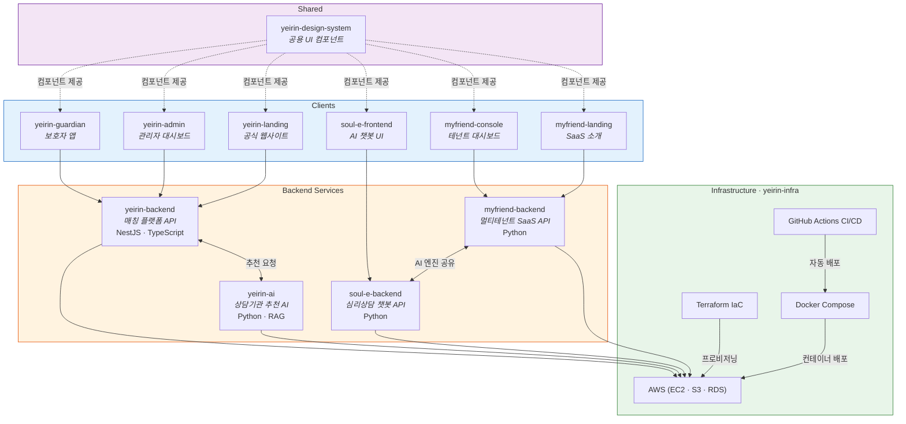

  
  <h1>예이린 사회적협동조합</h1>
  
<b>기술로 돌봄을 새롭게, 아이들의 내일을 따뜻하게</b>

  
대한민국을 넘어 글로벌 돌봄 혁신을 선도하는 Tech Non-Profit

   

  
  

 

## About

**예이린**은 아동·청소년 돌봄 분야의 사회 문제를 기술로 해결하는 **사회적협동조합**입니다.
AI 기반 상담 매칭, 심리상담 챗봇, B2B SaaS 플랫폼 등을 직접 설계·개발하며, 돌봄이 필요한 모든 아이에게 적절한 지원이 닿을 수 있도록 기술 인프라를 구축하고 있습니다.

 

## Architecture

 

## Projects

### Yeirin Platform &mdash; 상담기관 매칭 플랫폼

아동·청소년과 보호자가 적합한 상담 기관을 찾고 연결될 수 있도록 돕는 AI 기반 매칭 플랫폼입니다.

| Repository | Description | Stack |
|:--|:--|:--|
| [yeirin-backend](https://github.com/yeirin-dev/yeirin-backend) | 매칭 플랫폼 API 서버 (DDD + TDD) | NestJS · TypeScript |
| [yeirin-ai](https://github.com/yeirin-dev/yeirin-ai) | RAG 기반 상담기관 추천 AI 서비스 | Python · RAG |
| [yeirin-landing](https://github.com/yeirin-dev/yeirin-landing) | 공식 랜딩 페이지 | Next.js · TypeScript |
| yeirin-admin | 관리자 대시보드 | Next.js 16 · TypeScript |
| yeirin-guardian | 보호자용 클라이언트 | Next.js · TypeScript |

 

### Soul-E &mdash; 아동 심리상담 AI 챗봇

9~15세 아동·청소년을 위한 AI 심리상담 챗봇입니다. 전문 상담 전 초기 탐색과 정서적 지원을 제공합니다.

| Repository | Description | Stack |
|:--|:--|:--|
| [soul-e-frontend](https://github.com/yeirin-dev/soul-e-frontend) | 챗봇 프론트엔드 | Next.js · TypeScript |
| soul-e-backend | AI 상담 챗봇 백엔드 | Python |

 

### MyFriend (내친구) &mdash; AI 챗봇 B2B SaaS

기관·기업이 자체 AI 상담 챗봇을 손쉽게 구축할 수 있는 멀티테넌트 B2B SaaS 플랫폼입니다.

| Repository | Description | Stack |
|:--|:--|:--|
| myfriend-backend | 멀티테넌트 SaaS API 서버 | Python |
| myfriend-console | 테넌트 관리 대시보드 | Next.js 16 · React 19 |
| myfriend-landing | 서비스 소개 랜딩 페이지 | Next.js 16 · React 19 |

 

### Shared Infrastructure

| Repository | Description | Stack |
|:--|:--|:--|
| [yeirin-infra](https://github.com/yeirin-dev/yeirin-infra) | AWS 인프라 IaC 및 CI/CD 파이프라인 | Terraform · Docker · GitHub Actions |
| [yeirin-design-system](https://github.com/yeirin-dev/yeirin-design-system) | 공용 UI 컴포넌트 라이브러리 | React · TypeScript |

 

## Tech Stack

<table>
  <tr>
    <td><b>Frontend</b></td>
    <td>
      
      
      
      
    </td>
  </tr>
  <tr>
    <td><b>Backend</b></td>
    <td>
      
      
      
    </td>
  </tr>
  <tr>
    <td><b>AI / ML</b></td>
    <td>
      
      
    </td>
  </tr>
  <tr>
    <td><b>Database</b></td>
    <td>
      
      
      
    </td>
  </tr>
  <tr>
    <td><b>Infra / DevOps</b></td>
    <td>
      
      
      
      
      
    </td>
  </tr>
</table>

 

## Team

| Name | Role | GitHub |
|:--:|:--:|:--:|
| 윤상현 | CTO · Backend / DevOps | [@sxngt](https://github.com/sxngt) |
| 김훈정 | Frontend Engineer | [@hxont](https://github.com/hxont) |

 

  Since 2025.11 · 예이린 사회적협동조합 기술팀

